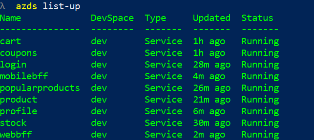
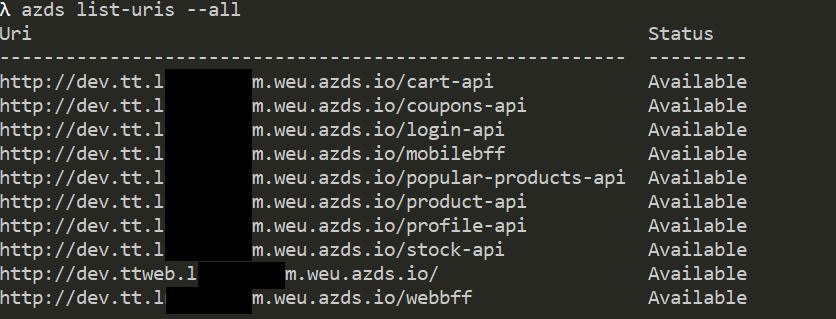
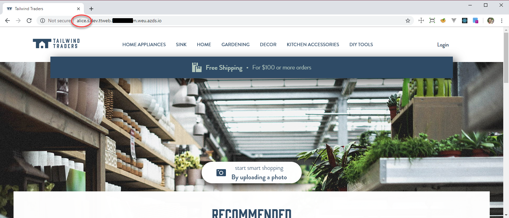

# Tailwind Traders: Demoscript for Devspaces with Java

The goal of this demo is to show the Azure Devspaces feature using a Java API. The API is the stock API.

## Key Takeaway

Azure devspaces allows debug and develop microservices in a team environment without disturbing other people work. Every developer has its own space where changes can be deployed without impacting other people.

## Before you begin

You will need:

- Visual Studio Code
- A Tailwind Traders environment (AKS and other Azure resources) and a Tailwind Traders configuration (a _gvalues.yaml_ file) created.
- Kubectl configured
- Azure CLI

## Pre-setup steps

Those steps need to be done once before the demo

### Introduce a bug in the stock API

Just comment following line:

```
response.setProductStock(stock.getStockCount());
```

from `Source/Services/Tailwind.Traders.Stock.Api/src/main/java/Tailwind/Traders/Stock/Api/StockController.java`.

This line introduces the bug in stock API that makes the API return all products out of stock.

There is no need to compile anything.

### Prepare the cluster for using devspaces

Type `az aks use-dev-spaces -g <resource-group> -n <aks-name>`. When propmted for a Kubernetes namespace to be used as a devspace, do not select _default_, instead enter `dev`. When propmted for the parent devspace, select `None` (0).

This will create a root devspace called `dev`.

### Prepare source for Devspaces

Deploy using Devspaces is done using the same Helm charts (located in `/Deploy/helm`) used in the standard deployment. You need to have a valid _gvalues.yaml_ configuration file created. From a Powershell command line in folder `/Source` type:

```ps
.\prepare-devspaces.ps1 -file <path-to-your-gvalues-file>
```

This will copy your _gvalues_ file in `/Deploy/helm` folder with the name `gvalues.azds.yaml`. Devspaces deployment files expect to have the _gvalues_ file in that folder with that name (**note**: File is added in `.gitignore`).

### Deploy the `ttsa` account

All deployments of Tailwind Traders run under Kubernetes `ttsa` service account. You need to create manually this service account in the `dev` namespace. Just type `kubectl apply -f ttsa.yaml`. Please note that the `ttsa.yaml` file is in the `/Deploy/helm` folder, so run this from that folder or use a relative path.

### Deploy ALL apis to the dev devspace

The `dev` devspace acts as a root devspace, where "shared" version of code is deployed. This could be the code deployed by a CD pipeline.
To deploy, just run `azds up -d -v` from a command line, once in these folders:

* `/Source/Services/Tailwind.Traders.Cart.Api`
* `/Source/Services/Tailwind.Traders.Coupon.Api`
* `/Source/Services/Tailwind.Traders.Login.Api`
* `/Source/Services/Tailwind.Traders.PopularProduct.Api`
* `/Source/Services/Tailwind.Traders.Product.Api`
* `/Source/Services/Tailwind.Traders.Profile.Api`
* `/Source/Services/Tailwind.Traders.Stock.Api`
* `/Source/ApiGws/Tailwind.Traders.Bff`
* `/Source/ApiGws/Tailwind.Traders.WebBff`

Once finished, the `azds up` should list all APIs in root the devspace `dev`:



### Deploy the Web to the dev devspace

This needs to be done from the [TailwindTraders Web repository](https://github.com/Microsoft/TailwindTraders-Website)

Just run `azds up -d -v` from a command line in the folder:

* `/Source/Tailwind.Traders.Web`

### Try the parent devspace

The parent `dev` devspace is deployed, and ready to be tested. Run `azds list-uris --all` to get all the entry points for all APIs and the web:



When deploying on a devspace, all services are exposed using an ingress, even though the internal ones. for easy testing.

Now, grab the URL of the web and paste in your browser:


## Demo flow

In the demo, you play the role of Alice, a new developer that has a bug assigned to the Stock API.

### Facing the bug

Web shows all products "out of stock":


Data seems to be correct in the database, but no matter what product id is passed, stock api always return no stock:


### Creating a child devspace for Alice

Alice is assigned to solve this bug, so she creates a new devspace for her. This new devspace has to be a child devspace of the `dev` root devspace, by typing `azds space select` and creating a new dev space child of `dev`:


Alice can verify that she is in her own devspace by typing `azds space list` and checking the `dev/alice` devspace is selected (marked with an asterisk):


Great! Alice is in her own devspace, so all changes she deploy will be isolated to her, and won't afect other developers in the same development AKS. Alice gets their own entrypoints (URIs) to access their own versions of the services. If the service is not deployed in her devspace, the service deployed in the parent devspace (`dev`) will be used instead. As before the command `azds list-uris` shows the URLs of the services. As Alice has selected her `dev/alice` devspace, now she sees their own URIs:


### Deploy the ttsa service account on her namespace

**Before deploying any API to her own dev space** Alice has to deploy the `ttsa` service account. She need to do it only once using `kubectl`. The file to deploy is `/Deploy/helm/ttsa.yaml` and it has to be deployed in the namespace `alice` (because that was the name of her dev space):

```
kubectl apply -f Deploy\helm\ttsa.yaml -n alice
```

### Debugging the Tasks API using Visual Studio Code

It's time for Alice to use Visual Studio Code to debug the Task API. Alice has Visual Studio Code with following extensions installed:

* [Azure Dev Spaces for VS Code](https://marketplace.visualstudio.com/items?itemName=azuredevspaces.azds)
* [Java Extension Pack](https://marketplace.visualstudio.com/items?itemName=vscjava.vscode-java-pack)
* [Java for Azure Devspaces (Preview)](https://marketplace.visualstudio.com/items?itemName=vscjava.vscode-java-debugger-azds)

Alice goes to folder `/Source/Services/Tailwind.Traders.Stock.Api` and opens it with Visual Studio Code. Then selects the command _Azure Dev Spaces: Prepare configuration files for Azure Dev Spaces_


Visual Studio Code will ask for the base image to use (select the one based on Azul Zulu):


Finally VS Code will ask for the default port (leave 8080):


Once finished a `launch.json` and a `tasks.json` file would be generated in the `.vscode` directory. Now the debug window of VSCode should have the option "Launch Java program (AZDS)":


Alice use this option to launch the Tasks API on her own Dev Space. This will take a while, because 1st time VS Code needs to update all code in the Alice dev space (under the hoods a `azds up` is performed).

Visual Studio Code will show a **localhost** address in the status bar:


Alice can use this address to access the Tasks API **running on her dev space**. Don't be confused because is a _localhost_ address. Tasks API is not running in Alice's machine, it is running in AKS, the _localhost_ address is just tunneled. A `azds list-uris` run from command prompt will give the same info:


For starting her debug session Alice puts a break point in file `src/main/java/Tailwind/Traders/Stock/Api/StockController.java` in line where `stock` is checked against `null` in method `StockProduct`:


She nows need to trigger the breakpoint. There are two options:

1. Alice can use the _localhost_ address to make a direct call to the Task API. This is possible if she knows which is this call.
2. If Alice is a new developer she maybe don't know what is this call, but she knows how to reproduce the error: using the web and going to the details of one product.

Using option 1 is as easy as doing a call with curl to the endpoint `/v1/stock/{product_id}`:

```
curl http://localhost:55934/v1/stock/1
```

That will trigger the endpoint and the breakpoint should be hit:


The second option (using the web) shows how Dev Spaces is really powerful. **Even though Alice has not deployed the web on her dev space**, she gets a new URL to access the web. The command `azds list-uris` gives this new url:


Note how URLs starts with `alice.s`. So, Alice can open a web browser and navigate to the URL of the web (`alice.s.dev.ttweb.xxxxxxx`):



She now can use the web, login and going to a product detail **and the breakpoint will be hit**:


Now Alice can use the debug tools incorporated with Visual Studio Code to find the error. Seems that some developer left a line commented, and this is the source of the error:


Now Alice can stop the debug session and just fix the code uncommenting the line. Then **she can start a new debug session just to ensure the error is gone**. She don't need to build locally the project, starting a new session will synchronize the file she changed locally and rebuild the API in her dev space.

Once the new debug session is started, Alice just refreshes the browser window to check the error is gone:


Just to recap, Alice did all this debug session **without impacting any other developer**. The web now works as expected in his dev space while is still failing in the `dev` namespace:


Alice can now commit the code, and close the bug! CD pipeline will deploy the updated version of _Tasks API_ to the `dev` devspace, and all developers will get the fix.

## Demo cleanup

To cleanup the demo just:

* Select the dev devspace (`azds space select -n dev`)
* Delete the Alice devspace (`azds space remove -n alice`). This will delete the Kubernetes namespace `alice` and everything installed on it.

## To summarize

* Dev Spaces allows every developer to have a private workspace
* All changes one developer make, are isolated
* A developer only needs to deploy the API/service he is working on. All dependences are used from the parent dev space
* Dev space is not only for netcore. Deploying in a devspace is supported for any technology. Debugging is currently supported in netcore, java and nodejs.


