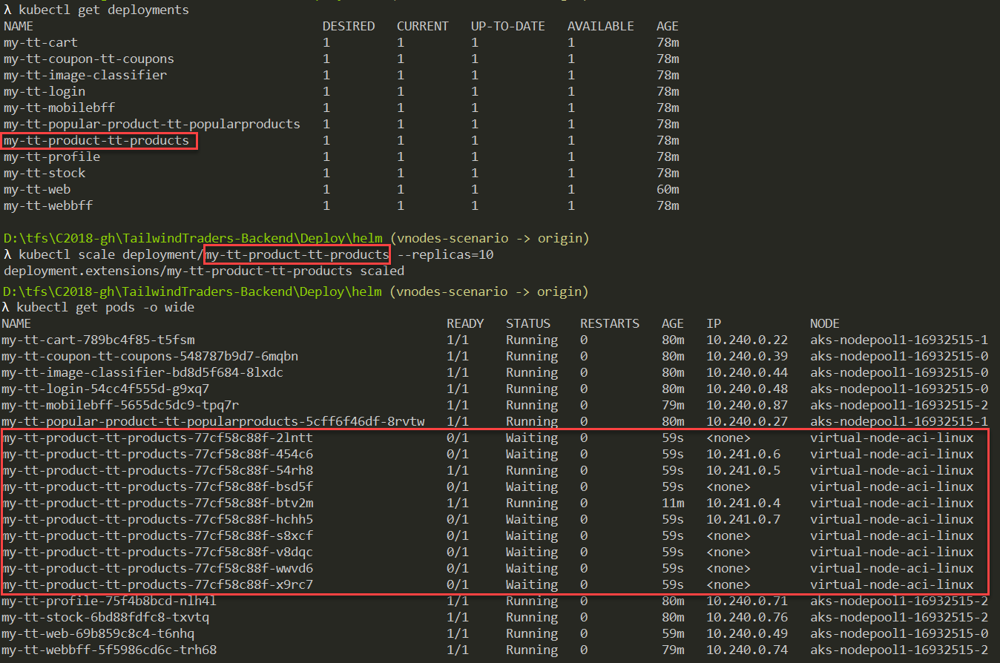

# Tailwind Traders: Demoscript for Virtual Nodes

The goal of this demo is to view the AKS "virtual nodes" feature, that enables running some AKS pods in ACI

## Key Takeaway

Virtual Nodes is a key feature of AKS that run some pods in ACI to allow for high scalability in scenarios where scalability can vary a lot. This demo starts with a "standard" deploy of Tailwind Traders Backend, and then this deploy is updated to allow some APIs to run on virtual nodes.

## Before you begin

You will need:

- Azure CLI installed

## Pre-setup steps

Those steps need to be done once before the demo:

### Create the AKS with vnodes enabled

The [ARM script](../../../Deploy/deployment.json) provided with Tailwind Traders is not configured to create an AKS with virtual nodes feature enabled, and as this feature can'be added to an AKS after its creation, **you will need to create an AKS with virtual nodes enabled**. You can:

* [Use Azure portal to create an AKS with virtual nodes enabled](https://docs.microsoft.com/en-us/azure/aks/virtual-nodes-portal)
* [Use the CLI to create an AKS with virtual nodes enabled](https://docs.microsoft.com/en-us/azure/aks/virtual-nodes-cli)
* Run the powershell script `/Deploy/vnodes/Create-Aks.ps1`.

The powershell script has following parameters:

* `-resourceGroup`: Resource group to use. **Mandatory**. If not exists will be created.
* `-location`: Location where to create the resource group if needed. Defaults to `eastus2`
* `-aksName`: Name of the AKS cluster to create. Defaults to `ttvnodes`

### Create an ACR

Type following command to create an ACR:

```
az acr create -g <resource-group> -n <acr-name> --admin-enabled true --sku Standard
```

### Deploy Azure infrastructure

Run the `/Deploy/Deploy-Arm-Azure.ps1` script with following parameters:

* `-resourceGroup`: Resource group where to deploy all Azure infrastructure. If not exists it is created.
* `-location`: Location where create the resource group if needed
* -`-deployAks`: Set it to `$false` to NOT create the AKS.

### Deploy the Backend to the AKS

First step is to deploy the backend in the AKS. This is a standard deployment, with no virtual nodes enabled. Follow steps described in the [Tailwind Traders Backend Deployment Guide](../../DeploymentGuide.md)

## Demo Flow

In this demo a stress situation like Black Friday is simulated. In the Black Friday a lot of product queries are expected, so the Products API, needs to be able to handle high load. For this the deployment of the "Products API" will be updated to use virtual nodes.

### Updating the "Products API" deployment

Run `helm ls` command to find the _Products API_ release name. If you did not override the `-name` parameter in the `Deploy-Images-Aks.ps1` script, the release should be named `my-tt-product`. Is the release that has was installed by chart `tt-products`.


First update will be just force products API to run on virtual nodes. This is accomplished by adding some `nodeSelector` and `tolerations` to the product API pods. The exact values are in file `/Deploy/helm/vnodes/vnodes.yaml`.

**From a command line located in `/Deploy/helm` folder**, type following command to upgrade the helm release adding these new values:

```
helm upgrade --reuse-values --recreate-pods -f vnodes\vnodes.yaml my-tt-product .\products-api.
```

A `kubectl get pods -o wide` should make clear that the _Products API_ pod is running on the virtual node:


If you go to the azure portal, to the AKS associated resource group (the one that has the name like  `MC_<resrource-group>_<aks-name>_<region-name>`) you should see the ACI running the products API pod:


Congratulations! You are running the products API on virtual nodes.

### Manually scaling the products API

You can manually scale the products API by typing:

```
kubectl scale deployment/my-tt-product-tt-products --replicas=10
```



Each pod that runs in the virtual node is an ACI instance in the `MC_XXX` resource group:


### Auto scaling the products API

Better than scale manually the products API is to scale automatically using a Kubernetes standard _Horizontal Pod Autoscaler (HPA)_. The HPA definition is in file `/Deploy/helm/vnodes/hpa.yaml`.

Before deploying it, just scale down the products api deployment to one pod:

```
kubectl scale deployment/my-tt-product-tt-products --replicas=1
```

This will remove all pods (and the ACI resources) except one.

To deploy the HPA just upgrade the helm release again, but including the `hpa.yaml` file. **From a command line located in `/Deploy/helm` folder** type:

```
helm upgrade --reuse-values --recreate-pods -f vnodes\hpa.yaml my-tt-product .\products-api
```

Once upgraded, the `kubectl get hpa` should return one result:


### Start the "Black Friday"

Just run the script `/Deploy/helm/vnodes/BlackFriday.ps1` with following parameters:

* `-aksName`: Name of the AKS
* `-resourceGroup`: Resource group

The script will simulate a variable load against the Products API.

## Demo cleanup

To cleanup the demo:

Delete the products API release:

```
helm delete my-tt-product --purge
```

Then use the `/Deploy/Deploy-Images-Aks.ps1` with the parameter `-charts pr` to redeploy again only the products api:

```
.\Deploy-Images-Aks.ps1 -resourceGroup <resource-group> -aksName <aks-name> -acrName <acr-name> -valuesFile <path-to-gvalues-file> -charts pr -tlsEnv staging
```