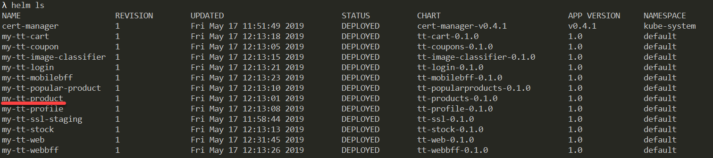
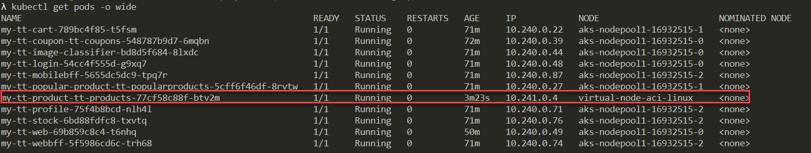
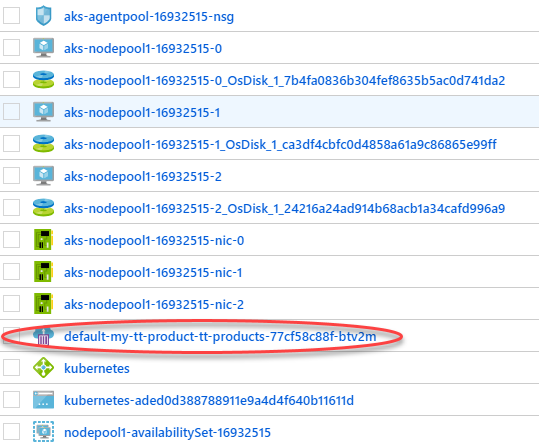
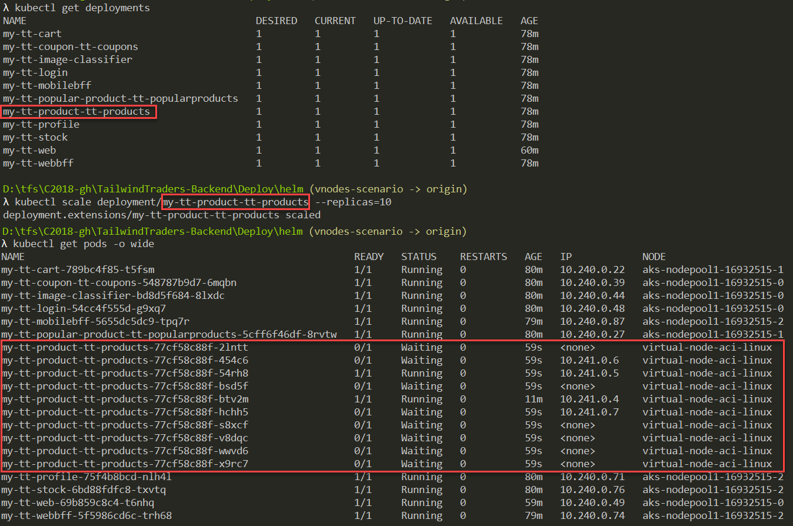

# Tailwind Traders Backend Services

# Azure Monitoring + Horizontal Pod Autoscaler (HPA) + Virtual Nodes in Azure Kubernetes Service (AKS)

This repository contains a guide of how enable Azure Monitoring to review the metrics in Azure Portal and enable HPA using Virtual nodes in AKS
This branch has all the necessary to deploy the scenario.

## About Virtual Nodes

Azure Kubernetes Service (AKS) virtual node allows you to elastically provision additional pods inside Container Instances that start in seconds. With a few clicks in the Azure portal, turn on the virtual node feature and get the flexibility and portability of a container-focused experience in your AKS environment without needing to manage the additional compute resources. And since your Azure Container Instances containers can join the same virtual network as the rest of your cluster, you can build Kubernetes services that seamlessly span pods running on virtual machines (VMs) and Azure Container Instances.

The goal of this demo is to view the AKS "virtual nodes" feature, that enables running some AKS pods in ACI.

## About HPA

Kubernetes uses the horizontal pod autoscaler (HPA) to monitor the resource demand and automatically scale the number of replicas. By default, the horizontal pod autoscaler checks the Metrics API every 30 seconds for any required changes in replica count. When changes are required, the number of replicas is increased or decreased accordingly. Horizontal pod autoscaler works with AKS clusters that have deployed the Metrics Server for Kubernetes 1.8+.

## About Azure Monitoring Service

Azure Monitor for containers is a feature designed to monitor the performance of container workloads deployed to either Azure Container Instances or managed Kubernetes clusters hosted on Azure Kubernetes Service (AKS). Azure Monitor for containers gives you performance visibility by collecting memory and processor metrics from controllers, nodes, and containers that are available in Kubernetes through the Metrics API.

## 1. Starting point

- First of all download and position yourself in this branch **demo/scale**

## 2. Create the AKS with Virtual Nodes enabled

The ARM script provided with Tailwind Traders is not configured to create an AKS with virtual nodes feature enabled, and as this feature cannot be added to an AKS after its creation, You will need to create an AKS with virtual nodes enabled.

- [Azure Portal](https://docs.microsoft.com/en-us/azure/aks/virtual-nodes-portal)
- [Azure CLI](https://docs.microsoft.com/en-us/azure/aks/virtual-nodes-cli)
- Run the powershell script /Deploy/vnodes/Create-Aks.ps1

The PowerShell script has following parameters:

- `-resourceGroup`: Resource group to use. Mandatory. If not exist will be created.
- `-location`: Location where to create the resource group if needed. Defaults to eastus2
- `-aksName`: Name of the AKS cluster to create. Defaults to ttvnodes

### Enable Azure Monitoring Addon in AKS

You can enable Azure Monitoring in two different ways.

- **When you are going to create AKS:**
  If you create your AKS using Azure CLI make sure or add if it does not exist the following parameter:

  ```
  --enable-addons monitoring `
  ```

  For example (only ):

  ```
  az aks create --resource-group $resourceGroup `
    --enable-addons monitoring `
    ... more parameters
  ```

- **When your AKS is already created:**

  Execute the following command to implement Azure Monitoring in the selected AKS:

  ```
  az aks enable-addons -a monitoring -n MyExistingManagedCluster -g MyExistingManagedClusterRG
  ```

## 3. Create an Azure Content Registry (ACR)

Type following command to create an ACR:

```
az acr create -g <resource-group> -n <acr-name> --admin-enabled true --sku Standard
```

## 4. Deploy Azure infrastructure

Run the /Deploy/Deploy-Arm-Azure.ps1 script with following parameters:

- `-resourceGroup`: Resource group where to deploy all Azure infrastructure. If not exists it is created.
- `-location`: Location where create the resource group if needed
- `-deployAks`: Set it to `$false` because AKS is already is created

Example command:

```
.\Deploy-Arm-Azure.ps1 -resourceGroup <resource-group> -location <location> -deployAks $false
```

After that:

**Creating the stockdb database in PostgreSQL**

Once the deployment is finished an additional step has to be done: You need to create a database named stockdb in the PostgreSQL server. For this you need the Azure CLI installed.

Just type the command:

```
az postgres db create -g <resource-group> -s <posgres-server-name> -n stockdb
```

## 5.1 Deploy the Backend in the AKS

This section is explained in the general readme read: https://github.com/Microsoft/TailwindTraders-Backend

Also these are the steps that we recommend followed this order:

- [Service Principal](https://github.com/Microsoft/TailwindTraders-Backend#Service-Principal)
- [Connecting kubectl to AKS](https://github.com/Microsoft/TailwindTraders-Backend#Connecting-kubectl-to-AKS)
- [Installing Tiller on AKS](https://github.com/Microsoft/TailwindTraders-Backend#Installing-Tiller-on-AKS)
- [Configuring services](https://github.com/Microsoft/TailwindTraders-Backend#Configuring-services)
- [Create secrets on the AKS](https://github.com/Microsoft/TailwindTraders-Backend#Create-secrets-on-the-AKS)
- [Build & deploy images to ACR](https://github.com/Microsoft/TailwindTraders-Backend#Build-%26-deploy-images-to-ACR)

## 5.2 Deploy the Backend in the AKS - Deploy services

This section is already explained inside the 5.1 Link, but we need to run `./Deploy-Images-Aks.ps1` script enabling`-autoscale` parameter.

**For example:**

**All services**

```
.\Deploy-Images-Aks.ps1 -name my-tt -aksName AKSname -resourceGroup resourceGroupname -acrName acrName -valuesFile .\_\_values\yourValuesFile.yaml -useInfraInAks $false -tlsEnv staging -autoscale $true
```

**Selected Service**

In order to select a specific service use -chart parameter with the predefine value:

- `pr` Products API
- `cp` Coupons API
- `pf` Profiles API
- `pp` Popular products API
- `st` Stock API
- `ic` Image classifier API
- `ct` Shopping cart API
- `lg` Login API
- `rr` Rewards Registration
- `mgw` Mobile Api Gateway
- `wgw` Web Api Gateway

For example products service (`-charts pr`):

```
.\Deploy-Images-Aks.ps1 -name my-tt -aksName AKSname -resourceGroup resourceGroupname -acrName acrName -charts pr -valuesFile .\_\_values\yourValuesFile.yaml -useInfraInAks $false -tlsEnv staging -autoscale $true
```

## 6. Updating the "Products API" deployment into Virtual Node

Run `helm ls` command to find the **Products API** release name. If you did not override the `-name` parameter in the `Deploy-Images-Aks.ps1` script, the release should be named `my-tt-product`.



The first update will be just to force Products API to run on virtual nodes. This is accomplished by adding some `nodeSelector` and `tolerations` to the product API pods. The exact values are in file `/Deploy/helm/vnodes/vnodes.yaml`.

**From a command line located in `/Deploy/helm` folder**, type following command to upgrade the helm release adding these new values:

```
helm upgrade --reuse-values --recreate-pods -f vnodes\vnodes.yaml my-tt-product .\products-api
```

A kubectl get pods -o wide should make clear that the Products API pod is running on the virtual node:



If you go to the azure portal, to the AKS associated resource group (the one that has the name like `MC_<resrource-group>_<aks-name>_<region-name>`) you should see the ACI running the products API pod:



**Congratulations! You are running the products API on virtual nodes**

## 7.1 Scaling the products API manually

You can manually scale the products API by typing:

```
kubectl scale deployment/my-tt-product-tt-products --replicas=10
```



Each pod that runs in the virtual node is an ACI instance in the MC_XXX resource group:


## 7.2 Auto scaling the products API

Apart from scaling manually, the products API can be configured to scale automatically using a Kubernetes standard Horizontal Pod Autoscaler (HPA). The HPA definition is in file `/Deploy/helm/vnodes/hpa.yaml`.

Before deploying it, just scale down the products api deployment to one pod:

```
kubectl scale deployment/my-tt-product-tt-products --replicas=1
```

This will remove all pods (and the ACI resources) except one.

If you deploy service with `-autoscale $true` if you run `kubectl get hpa` you will see all pods like:

## 8. Start the "Black Friday" simulation

Just run the script /Deploy/helm/vnodes/BlackFriday.ps1 with following parameters: (we recommend open 3 different instances of it)
Run it with x64 PowerShell **mandatory**

- `-aksName`: Name of the AKS
- `-resourceGroup`: Resource group

The script will simulate a variable load against the Products API.

After the simulation, you can cleanup the demo for exploring further -

Delete the products API release:

```
helm delete my-tt-product --purge
```

Then use the /Deploy/Deploy-Images-Aks.ps1 with the parameter -charts pr to redeploy again only the products api in **no** virtual nodes:

```
.\Deploy-Images-Aks.ps1 -resourceGroup <resource-group> -aksName <aks-name> -acrName <acr-name> -valuesFile <path-to-gvalues-file> -charts pr -tlsEnv staging
```

## 9. Verify

To verify the demostration you can run this commands:

To see how increments **target** usage and MINPODS/MAXPODS defined.

```
kubectl describe hpa <podName>
```

To see how increments scaling number of replicas (product pods).

```
kubectl get pods -o wide
```

To see CPU(cores) and Memory(bytes) incrementation

```
kubectl top pode
```

or **in Azure Portal**

- Access the monitoring section typing in "Monitor" in the search engine
- Select Containers in the vertical menu
- Select Monitored clusters. Inside the list our cluster
- Inside our selected cluster we can see different data and graphs

In this section we can analyze some aspects of our cluster:
<a href="https://docs.microsoft.com/en-us/azure/azure-monitor/insights/container-insights-analyze">Understand AKS cluster performance with Azure Monitor for containers</a>

## Summary

Azure makes development teams working with micro services and Kubernetes more efficient by combining the capabilities of Visual Studio and AKS Dev Spaces. Operations team become more reliable by using powerful services like Virtual Nodes to spin up instant serverless containers when you need it the most.
